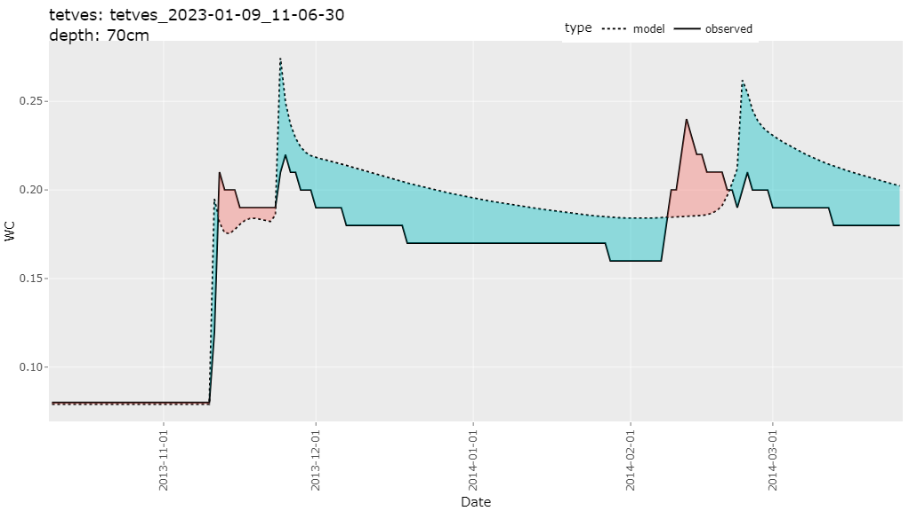
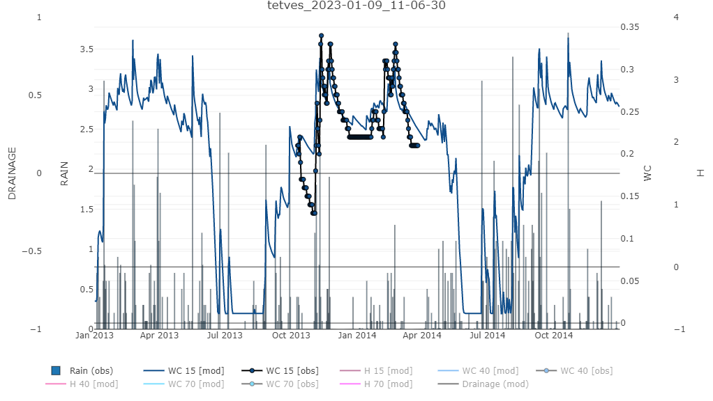

# rswap ⚠️prerelease!⚠️

rswap is an R-package designed to help interface and work with [SWAP 4.2.0](https://www.swap.alterra.nl/) [[1]](#1). It consists of a variety of functions that assist the user in otherwise tedious and repetitive tasks during the calibration proccess. The scope of the package will hopefully be expanded overtime to include sensitivity analysis, multi-core parallelization, autocalibration / PEST integration, scenario runs, and much more. **DISCLAIMER: rswap is very much in development, and therefore not robustly tested, nor extremely stable. use at your own risk, and be critical of the results, for now..**

## How to install?

You can install `rswap` from GitHub: 

```r
# install remotes, if not already present
install.packages("remotes")

remotes::install_github("moritzshore/rswap")

library(rswap)
```
A useful place to start would be the `rswap_init()` function. This function creates the "Hupselbrook" example case in the same directory as your `swap.exe`. It goes on to run the setup, copy in the observed data template file, and plot the results. If this function finished succesfully, you know `rswap` is working properly. 
```
rswap_init(swapexe = "C:/path/to/swap.exe")
```
for help on any specific function, use ```> ?functionname```

**⚠️IMPORTANT⚠️** Its important to know that rswap never modifies files in your project directory (`project_path`), instead all files are *copied* from `project_path` to `project_path/rswap`, modified there, and executed. All results are stored there as well, and will be overwritten over time. Remeber to save your results if you would like to keep them, and remeber that anything in the `project_path/rswap` directory is temporary!

## How to run SWAP?
The SWAP model can be run using the `run_swap()` function. It needs to know where your model setup is located (`project_path`). The `swap.exe` must be located in the parent directory of `project_path`!

```
run_swap(project_path)
```

`run_swap()` can be further customized with the following parameters:
- `swap_file` can be set to a custom name for your SWAP main file (*.swp)
- `autoset_output` can be enabled, such that the output of the SWAP model matches your provided observed data (more on that later)
- `timeout` sets the max allowed runtime of SWAP
## How to access the data?

To read the output of your executed SWAP run, you can use the following command
```
modelled_data <- read_swap_output(project_path)
```
`read_swap_output()` returns two dataframes, `daily_output` which contains depthwise values of various variables.
```
> modelled_data$daily_output
# A tibble: 17,520 x 5
   DATE       DEPTH     H    WC  TEMP
   <chr>      <dbl> <dbl> <dbl> <dbl>
 1 2013-01-01  -0.5 -687. 0.118     0
 2 2013-01-01  -1.5 -684. 0.118     0
 3 2013-01-01  -2.5 -680. 0.118     0
# i 17,517 more rows
# i Use `print(n = ...)` to see more rows
```
The other is `custom_depth` which contains custom variables at custom depths either explictly altered by the user, or automatically parsed by the `autoset_output` flag of `run_swap()`. This dataframe is used widely throughout the package. (more/all results will be added over time) 

```
> modelled_data$custom_depth
# A tibble: 730 x 14
   DATE        RAIN  SNOW DRAINAGE    DSTOR  H_10  H_20  H_30 WC_15 WC_40 WC_70 TEMP_15 TEMP_40 TEMP_70
   <date>     <dbl> <dbl>    <dbl>    <dbl> <dbl> <dbl> <dbl> <dbl> <dbl> <dbl>   <dbl>   <dbl>   <dbl>
 1 2013-01-01   0       0        0 -0.0266  -648. -603. -550. 0.122 0.111 0.111       0       0       0
 2 2013-01-02   0       0        0 -0.027   -624. -597. -564. 0.124 0.107 0.111       0       0       0
 3 2013-01-03   0       0        0 -0.0305  -618. -595. -568. 0.124 0.104 0.111       0       0       0
# i 727 more rows
# i Use `print(n = ...)` to see more rows
```

As rswap heavily revolves around calibration, observed data is of high importance. When running either `build_rswap_directory()` or `run_swap()`, a template observed file will be copied into the `project_directory` (if not already existing). It is up to the user to fill this excel sheet with the appropriate data and column names. Documentation for how to do this will be found in the excel sheet. (I will switch to .csv format soon)

To load your observed file, you can use the following command:
```
observed_data <- load_observed(project_path)
```
which will return a dataframe of the user-entered observed data:
```
> observed_data$data
# A tibble: 168 x 11
   DATE       WC_15 WC_40 WC_70  H_15  H_40  H_70 DRAINAGE TEMP_15 TEMP_40 TEMP_70
   <date>     <dbl> <dbl> <dbl> <dbl> <dbl> <dbl>    <dbl>   <dbl>   <dbl>   <dbl>
 1 2013-10-10  0.21  0.12  0.08  0.21  0.12  0.08     0.21    0.12    0.08    0.21
 2 2013-10-11  0.21  0.12  0.08  0.21  0.12  0.08     0.21    0.12    0.08    0.21
 3 2013-10-12  0.2   0.12  0.08  0.2   0.12  0.08     0.2     0.12    0.08    0.2 
# i 158 more rows
# i Use `print(n = ...)` to see more rows
```
...as well as a vector for the detected variables
```
> observed_data$observed_variables
[1] "WC"       "H"        "DRAINAGE" "TEMP" 
```
To find out what depths your observed variables have, you can use the following command:
```
get_depths(observed_data$data)
```
..this can also be filtered by a specific variable by passing `variable`

## Visuals

There are a variety of functions used to visualize your SWAP data, such as `plot_over_under()`
```
plot_over_under(project_path, variable = "WC", depth = c(15, 40, 70))
```
`plot_over_und()` can be passed a `variable`, as well as a vector `depth`.


<p align="center">

</p>

>(this plot heavily relies on code from [Neal Grantham](https://www.nsgrantham.com/fill-between-two-lines-ggplot2/))

For a more detailed look at multiple variables at once, you can use the `soft_calibration_plot()`
```
> soft_calibration_plot(project_path, vars = c("H", "WC", "DRAINAGE"))
```
This function can be passed up to 3 variables, and will display them interactively on the same plot. If observed data is avaiable, they will be displayed as well.  


<p align="center">

</p>

## Model performance

A few functions focus on assesing model performance by comparing modelling values to user provided observed values. This functionality is based on the `get_performance()` function:
```
> get_performance(project_path, stat = "NSE", variable = "WC", depth = 15)

# A tibble: 1 × 2                                                                                           
  var     NSE
  <chr> <dbl>
1 WC_15  0.62
```
This function is very flexible, and can be passed any number of `variables`, `depths`, and performance indicators `stat` (currently supported are `NSE`, `PBIAS`, `RSR`, and `RMSE`. 

## Saving model runs
While calibrating a model it can be useful to keep track of different model runs with different parameterization. `rswap` aids this proccess with a vareity of functions, such as
```
save_run(project_path, run_name = "COFRED = 0.35")
```
This function saves your entire model set up in a directory (`project_directory/rswap_saved`). Once a model run has been saved, it can be compared to other model runs, with the following functions.

## Comparing model runs

Once you have saved at least one run, you can compare them using the 
```
comparative_plot(project_path, variable = "WC", depth = 15)
```

<p align="center">

</p>

Once again, this function is quite flexible, and can be passed any available `variable` or `depth`

You can compare the performance of your various model runs by using the `plot_statistics()` function. 

```
plot_statistics(project_path, var = "WC", depth = c(15,40,70))
```
<p align="center">

</p>

This plot is equally flexible, and can be passed any `variable` and any amount of `depths` for any supported `stat`. the graph type can be switched between `default`, `sorted` and `ggplot`

## Modification of Parameters and SWAP input files.

changing a parameter in rswap can be done using the `parse_swap_file()` function. 
```
parsed <- parse_swp_file(project_path, swap_file)
```
This returns both a dataframe of all the parameters, as well as a path to where the saved tables are located (I am working on getting a "list of dataframes" to work in R, instead of just writing tables #TODO!)

You can modify the dataframe how you wish, with whatever tools you would like, however `rswap` does have a simple dedicated function to do this for you. 
```
parameters <- change_swap_par(param = parsed$parameters, name = "COFRED", value = 0.55)
```
This function takes in the dataframe parsed by the previous function, and returns that same dataframe with the modified parameter.

If you would like to run SWAP with the modified parameter set, you first would write the new SWAP main file:
```
write_swap_file(parameters = parameters, table_path = parsed$table_path, outpath = paste0(project_path, "/modified.swp"))
```
And to run this modified SWAP main file, you would of course use `run_swap()` with the corresponding `project_path` and `swap_file` parameters. 

## Miscellaneous functions

The aformentioned functions rely on more basic general functions which, while are designed for internal use, can possibly also be of assitance to the end user. These are listed below. 

>`NSE() # statistical performance calculation`

>`PBIAS() # statistical performance calculation`

>`RMSE() # statistical performance calculation`

>`RSR() # statistical performance calculation`

>`clean_swp_file() # returns swap main file sans comments`

> `filter_swap_data() # filters SWAP data (observed or modelled) by var and depth`

>`get_swap_units() # returns unit of SWAP variable. (WIP)`

>`match_mod_obs() # matches dataframe structure of observed and modelled` 

>`melt_all_runs() # melts together all saved runs + current into` [tidy](https://towardsdatascience.com/what-is-tidy-data-d58bb9ad2458) `format` 

## Roadmap
- Linux Support
- Sensitivity Analysis
- Autocalibration / PEST support
- Parsing support for all swap files, not just the main file.
- Add documentation in the excel sheet (and switch to supporting .csv instead!)
- Add support for multiple variables at differing depths for `autoset_output`
- Fix the x-axis on the over/under plot, and support missing values
- Give all exported rswap functions a consistent naming scheme (`verb_swap_noun()`)
- Move change_swap_parameter() from io.R to rw_parameters.R
- Add a "filename" par to write_swap_output()
- Wrapper function to combine `parse_swp_file()` and `change_swap_par()` (and `write_swap_file()`?)
- Expand and improve documentation
- plot_stat sorting to follow stat property
- Improve r/w of tables
- Add error message for when stat_plot / compare runs / melt runs encounters runs with differing output formats

## Support and Contributing

If you run into any bugs or problems, please open an issue on the repository page. (or contact me directly: moritz.shore@nibio.no)
The same goes for if you have any suggestions for improvement.
If would you like to contribute to the project, let me know! Very open towards collaborative improvement. Fork/Branch off as you please :)

## References

[1] Van Dam, J. Field-Scale Water Flow and Solute Transport: SWAP Model Concepts, Parameter Estimation, and Case Studies. Ph.D. Thesis, Wageningen University, Wageningen, The Netherlands, 2000.
