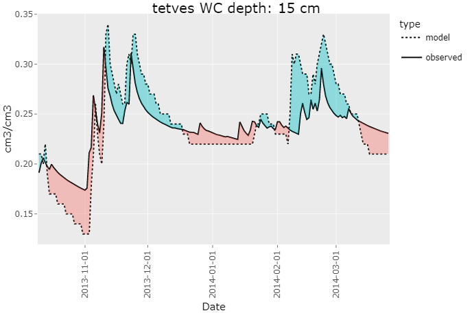

# rswap 

rswap is an R-package designed to help interface and work with [SWAP4](https://www.swap.alterra.nl/) [[1]](#1). It consists of a variety of functions that assist the user in otherwise tedious and repetitive tasks during the calibration process. The scope of the package will hopefully be expanded overtime to include sensitivity analysis, multi-core parallelization, autocalibration / PEST integration, scenario runs, and much more. **DISCLAIMER: rswap is very much in development, and therefore not robustly tested, nor extremely stable. use at your own risk, and be critical of the results, for now..**


[](https://doi.org/10.5281/zenodo.7795153)

# Table of contents
1. [Installing rswap](#install)
2. [Running SWAP](#run)
3. [Accessing data](#data)
4. [Visuals](#visuals)
5. [Model Performance](#performance)
6. [Saving model runs](#saving)
7. [Comparing model runs](#compare)
8. [Modification of Parameters](#mod)
9. [SWAPtools Integration](#swaptools)
10. [Miscellaneous functions](#misc)
11. [Roadmap](#roadmap)
12. [Support and Contributing](#support)
13. [Acknowledgements](#ack)
[References](#ref)

## Installing `rswap` <a name="install"></a>

You can install `rswap` from GitHub: 

```
# install remotes, if not already present
install.packages("remotes")

remotes::install_github(repo = "moritzshore/rswap", ref = remotes::github_release())

library(rswap)
```
A useful place to start would be the `rswap_init()` function. This function creates the "Hupselbrook" example case in the same directory as your `swap.exe`. It goes on to run the setup, copy in the observed data template file, and plot the results. If this function finished successfully, you know `rswap` is working properly.
```
project_path <- rswap_init(swapexe = "C:/path/to/swap.exe")
```

**⚠️IMPORTANT⚠️** Its important to know that `rswap` never modifies files in your project directory (`project_path`), instead all files are *copied* from `project_path` to `project_path/rswap`, modified there, and executed. All results are stored there as well and will be overwritten over time. Remember to save your results if you would like to keep them (`save_run()`), and remember that anything in the `project_path/rswap` directory is temporary!

## How to run SWAP? <a name="run"></a>

The SWAP model can be run using the `run_swap()` function. It needs to know where your model setup is located (`project_path`). The `swap.exe` must be located in the parent directory of `project_path`!

```
run_swap(project_path)
```

`run_swap()` can be further customized with the following parameters:

- `swap_file` can be set to a custom name for your SWAP main file (*.swp)
- `autoset_output` can be enabled, such that the output of the SWAP model matches your provided observed data
- `timeout` sets the max allowed runtime of SWAP

## Accessing the data  <a name="data"></a>

To read the output of your executed SWAP run, you can use the following command:
```
modelled_data <- read_swap_output(project_path)
```
`read_swap_output()` returns two dataframes, `daily_output` which contains depth wise values of various variables.
```
> modelled_data$daily_output
# A tibble: 17,520 x 5
   DATE       DEPTH     H    WC  TEMP
   <chr>      <dbl> <dbl> <dbl> <dbl>
 1 2013-01-01  -0.5 -687. 0.118     0
 2 2013-01-01  -1.5 -684. 0.118     0
 3 2013-01-01  -2.5 -680. 0.118     0
# i 17,517 more rows
# i Use `print(n = ...)` to see more rows
```
The other is `custom_depth` which contains custom variables at custom depths either explicitly altered by the user, or automatically parsed by the `autoset_output` flag of `run_swap()`. This dataframe is used widely throughout the package. (more/all results will be added over time) 

```
> modelled_data$custom_depth
# A tibble: 730 x 14
   DATE        RAIN  SNOW DRAINAGE    DSTOR  H_10  H_20  H_30 WC_15 WC_40 WC_70 TEMP_15 TEMP_40 TEMP_70
   <date>     <dbl> <dbl>    <dbl>    <dbl> <dbl> <dbl> <dbl> <dbl> <dbl> <dbl>   <dbl>   <dbl>   <dbl>
 1 2013-01-01   0       0        0 -0.0266  -648. -603. -550. 0.122 0.111 0.111       0       0       0
 2 2013-01-02   0       0        0 -0.027   -624. -597. -564. 0.124 0.107 0.111       0       0       0
 3 2013-01-03   0       0        0 -0.0305  -618. -595. -568. 0.124 0.104 0.111       0       0       0
# i 727 more rows
# i Use `print(n = ...)` to see more rows
```

As rswap heavily revolves around calibration, observed data is of high importance. When running either `build_rswap_directory()` or `run_swap()`, a template observed file will be copied into the `project_directory` (if not already existing). It is up to the user to fill this file with the appropriate data and column names. Documentation for how to do this is in the file itself. 

To load your observed file, you can use the following command:
```
observed_data <- load_observed(project_path)
```
which will return a dataframe of the user-entered observed data:
```
> observed_data$data
# A tibble: 168 x 11
   DATE       WC_15 WC_40 WC_70  H_15  H_40  H_70 DRAINAGE TEMP_15 TEMP_40 TEMP_70
   <date>     <dbl> <dbl> <dbl> <dbl> <dbl> <dbl>    <dbl>   <dbl>   <dbl>   <dbl>
 1 2013-10-10  0.21  0.12  0.08  0.21  0.12  0.08     0.21    0.12    0.08    0.21
 2 2013-10-11  0.21  0.12  0.08  0.21  0.12  0.08     0.21    0.12    0.08    0.21
 3 2013-10-12  0.2   0.12  0.08  0.2   0.12  0.08     0.2     0.12    0.08    0.2 
# i 158 more rows
# i Use `print(n = ...)` to see more rows
```
...as well as a vector for the detected variables
```
> observed_data$observed_variables
[1] "WC"       "H"        "DRAINAGE" "TEMP" 
```
To find out what depths your observed variables have, you can use the following command:
```
get_depths(observed_data$data)
```
..this can also be filtered by a specific variable by passing `variable`

## Visuals  <a name="visuals"></a>

There are a variety of functions used to visualize your SWAP data, such as `plot_over_under()`
```
plot_over_under(project_path, variable = "WC", depth = c(15, 40, 70))
```
`plot_over_und()` can be passed a `variable`, as well as a vector `depth`.


<p align="center">

</p>

>(this plot heavily relies on code from [Neal Grantham](https://www.nsgrantham.com/fill-between-two-lines-ggplot2/))

For a more detailed look at multiple variables at once, you can use the `soft_calibration_plot()`
```
soft_calibration_plot(project_path, vars = c("H", "WC", "DRAINAGE"))
```
This function can be passed up to 3 variables, and will display them interactively on the same plot. If observed data is available, they will be displayed as well.  


<p align="center">

</p>

## Model performance  <a name="performance"></a>

A few functions focus on assessing model performance by comparing modelling values to user provided observed values. This functionality is based on the `get_performance()` function:
```
get_performance(project_path, stat = "NSE", variable = "WC", depth = 15)

# # A tibble: 1 × 2                                                                                           
#   var     NSE
#   <chr> <dbl>
# 1 WC_15  0.62
```
This function is very flexible and can be passed any number of `variables`, `depths`, and performance indicators `stat` (currently supported are `NSE`, `PBIAS`, `RSR`, and `RMSE`. 

## Saving model runs  <a name="saving"></a>

While calibrating a model it can be useful to keep track of different model runs with different parameterization. `rswap` aids this process with a variety of functions, such as
```
save_run(project_path, run_name = "COFRED = 0.35")
```
This function saves your entire model set up in a directory (`project_directory/rswap_saved`). Once a model run has been saved, it can be compared to other model runs, with the following functions.

## Comparing model runs  <a name="compare"></a>

```
comparative_plot(project_path, variable = "WC", depth = 15)
```

<p align="center">

</p>

Once again, this function is quite flexible, and can be passed any available `variable` or `depth`

You can compare the performance of your various model runs by using the `plot_statistics()` function. 

```
plot_statistics(project_path, var = "WC", depth = c(15,40,70))
```
<p align="center">

</p>

This plot is equally flexible and can be passed any `variable` and any amount of `depths` for any supported `stat`. the graph type can be switched between `default`, `sorted` and `ggplot`

## Modification of parameters  <a name="mod"></a>

Changing of parameters, tables, and vectors of the SWAP main file can be done with `rswap`. First, the SWAP file must be parsed, this is done by the `parse_swp_file()` function. 
```
paths <- parse_swp_file(project_path, swap_file = "swap.swp")
```
Once they have been parsed, they can be loaded, with the following functions for parameters, tables, and vectors, respectively:
```
param <- load_swap_parameters(project_path)
tables <- load_swap_tables(project_path)
vectors <- load_swap_vectors(project_path)
```
⚠️ If the project has not already been parsed by `rswap`, these functions will automatically parse the `swap_file` argument. 

Now, with the parameters, tables, and vectors parsed and loaded, we can alter them using:
```
param <- change_swap_par(param, name = "SHAPE", value = "0.75")
tables <- change_swap_table(tables, variable = "OSAT", row = 1, value = "0.34")
vectors <- change_swap_vector(vectors, variable = "OUTDAT", index = 1, value = "10-Jun-2013")
```
These functions then return the object, with the modified value(s). Please note this is a `dataframe` for the parameters, **but** a `list` of `dataframes` for the tables and vectors. You have the option of passing all the `dataframes` as returned by the `load_swap_tables()` function, or just the one you are interested in altering, or anything in-between.

⚠️ You have the choice of passing the value in `character` format as shown above, to assure `FORTRAN` compatible format, or you can use
the `set_swap_format()` function, to convert your value to the `FORTRAN` compatible format. 


If you would like to run SWAP with the modified parameter/table/vector set, you first would need write the new SWAP main file:
```
write_swap_file(project_path, outfile = "swap_modified.swp")
```
And to run this modified SWAP main file, you would of course use `run_swap()` with the corresponding `project_path` and `swap_file` parameters. 

You might be thinking right about now.. 

> Gee that is a lot of work just to change a parameter!

And you are correct, which is why I am going to implement a wrapper function to all these steps for you at once... `soon`

## SWAPtools integrations <a name="install"></a>

The following features are possible when using `rswap` with another SWAP-related R-package: `SWAPtools`

`get_swap_format()` returns the format of the given parameter, whereas `set_swap_format()` forces the value of the given parameter into the FORTRAN-required format. These functions rely on data from package `SWAPtools`. (Over time, `change_swap_par()` will use these automatically to protect you from incorrect formats)

```
get_swap_format(parameters = "ALTW")
# [1] "float"

set_swap_format(parameter = "ALTW", value = 5)
# [1] "5.0"
```

More functionality will be implemented over time.

## Miscellaneous functions  <a name="misc"></a>

The aforementioned functions rely on more basic general functions which, while are designed for internal use, can possibly also be of assistance to the end user. These are listed below. 

>`NSE() # statistical performance calculation`

>`PBIAS() # statistical performance calculation`

>`RMSE() # statistical performance calculation`

>`RSR() # statistical performance calculation`

>`clean_swp_file() # returns swap main file sans comments`

> `filter_swap_data() # filters SWAP data (observed or modelled) by var and depth`

>`match_mod_obs() # matches dataframe structure of observed and modelled` 

>`melt_all_runs() # melts together all saved runs + current into` [tidy](https://towardsdatascience.com/what-is-tidy-data-d58bb9ad2458) `format` 

## Roadmap  <a name="roadmap"></a>

### Major

- Linux Support (0.3.0)
- Sensitivity analysis (0.4.0)
- Multi-core running (0.5.0)
- Autocalibration / PEST integration (0.6.0)
- Scenario runs (0.7.0)
- SWAPtools plotting integration (0.8.0)
- ...(1.0)

### Minor

- Parsing support for all SWAP files, not just the main file.
- Add support for multiple variables at differing depths for `autoset_output`
- Update `plot_over_under()` to  use [ggbraid](https://nsgrantham.github.io/ggbraid/)
- Give all exported `rswap` functions a consistent naming scheme (`verb_swap_noun()`)
- Wrapper function to combine load/change/write functions
- `plot_statistics()` sorting to follow stat property
- Add "exact variable matching" and stop removing "RAIN" in `io.R` -> `melt_all_runs()`
- Renovate `soft_calibration_plot()` to accept any variable using new system.

## Support and Contributing  <a name="support"></a>

If you run into any bugs or problems, please open an [issue](https://github.com/moritzshore/rswap/issues). The same goes for if you have any suggestions for improvement.
If would you like to contribute to the project, let me know! Very open towards collaborative improvement. Fork/Branch off as you please :)

Any OPTAIN case-studies which use `rswap` are required to bake Moritz Shore a cake using a local recipe from the case-study country.  

## Acknowledgements  <a name="ack"></a>

This package was developed for the [OPTAIN](https://optain.eu) project and has received funding from the European Union's Horizon 2020 research and innovation program under grant agreement No. 862756.

## References  <a name="ref"></a>

[1] Van Dam, J. Field-Scale Water Flow and Solute Transport: SWAP Model Concepts, Parameter Estimation, and Case Studies. Ph.D. Thesis, Wageningen University, Wageningen, The Netherlands, 2000. <a name="1"></a>

## 

<p align="center">

</p>
